# 教你用Python爬美之图APP(妹子图)

### 爬取结果

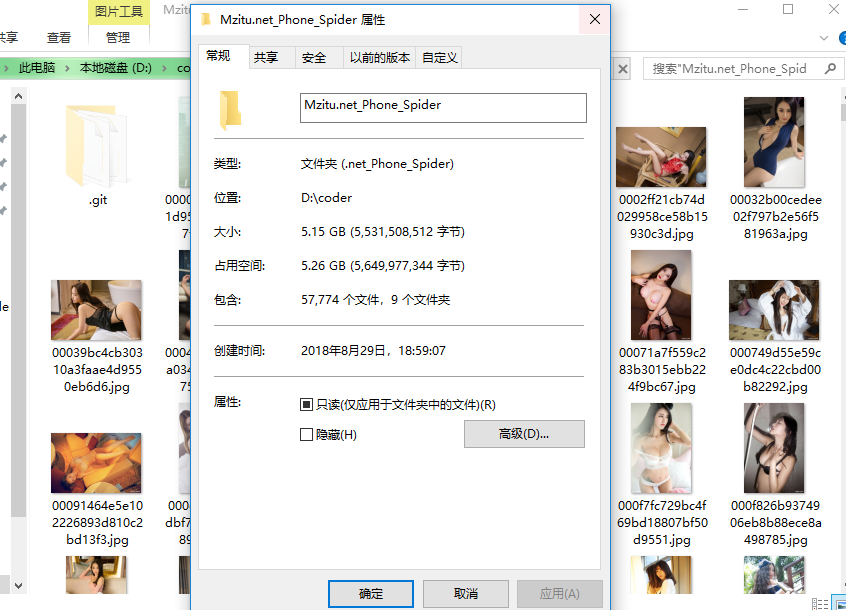

程序只运行了2h,最后认为程序没有问题了就关了(我可不是去杀生去了......

### 运行环境

- Python 3.5+

- Windows 10

- VSCode

### 如何使用

**下载项目源码**

`https://github.com/cexll/Mzitu.net_Spider.git`

### 安装依赖

`$ pip install requests`

### 运行

```
python3 Spider.py
...
程序共耗时: 80.55049586296082(不保存图片到本地的时间)
```
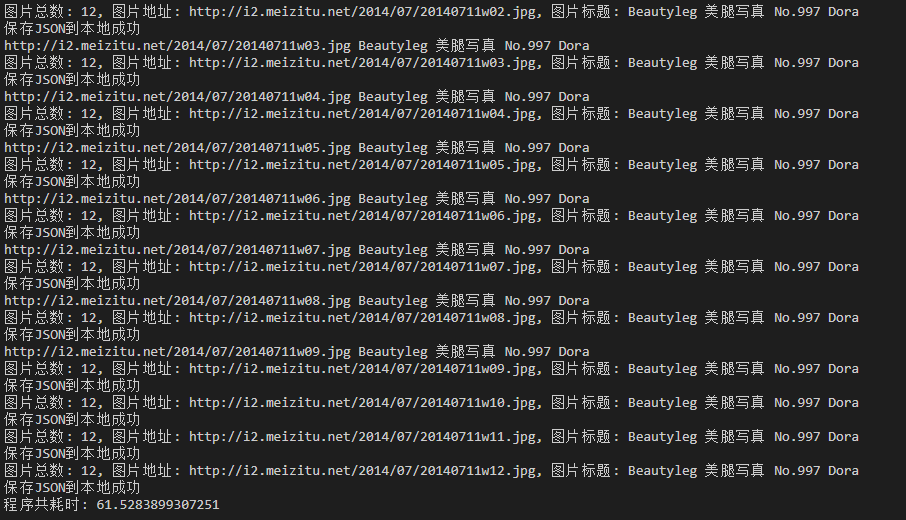
*保存图片需要网络,服务器等方面,所以不方便测试一般2h~3h能爬完整站*


## 信息来源

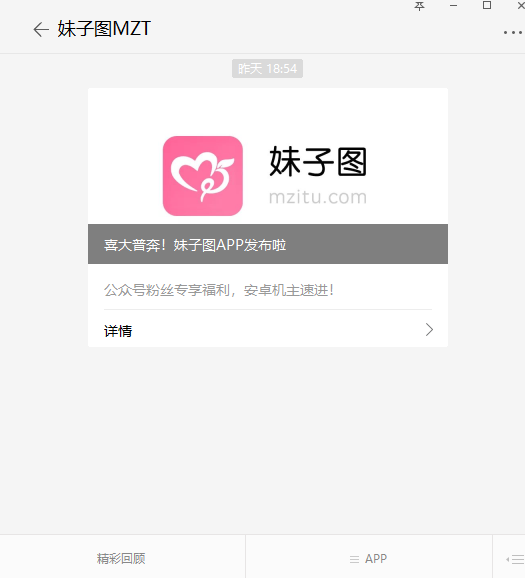

点击`APP`这个导航,然后点击`下载APP`,得到一条信息
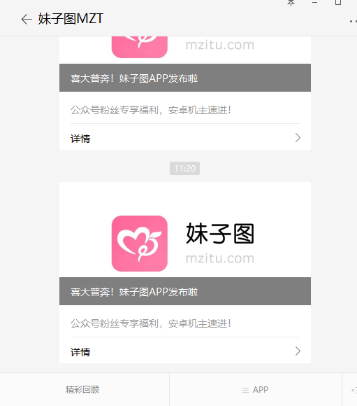

打开之后

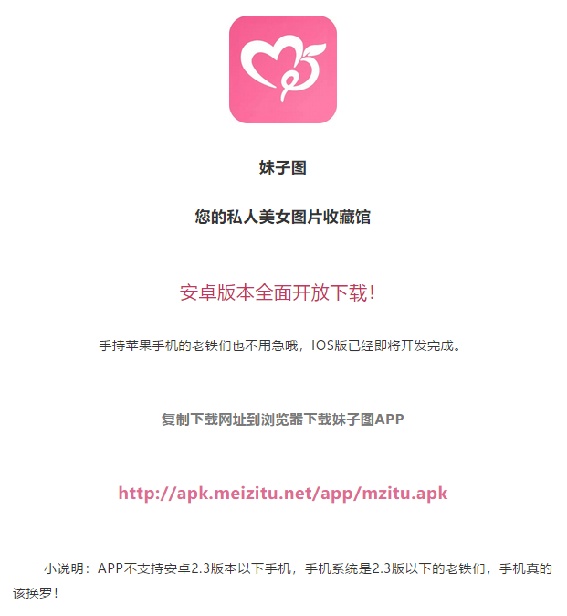

```
http://apk.meizitu.net/app/mzitu.apk
```

APP 下载链接, 嗯.APP打开之后大致就是这个样子 


没有涉黄吧 ...............

*只想要APP的同学到这里就可以离开了/滑稽*

## 思路

*最近学习了`APP`抓取,就想着来试试,结果还是非常顺利,好的,接下来开始*


抓包工具 `Charles`, 通过手机或者模拟器连接 `Charles` 8888 端口, 安装好证书就能通过电脑监控手机的网络请求信息 

提供下载地址: `https://www.charlesproxy.com/download/`

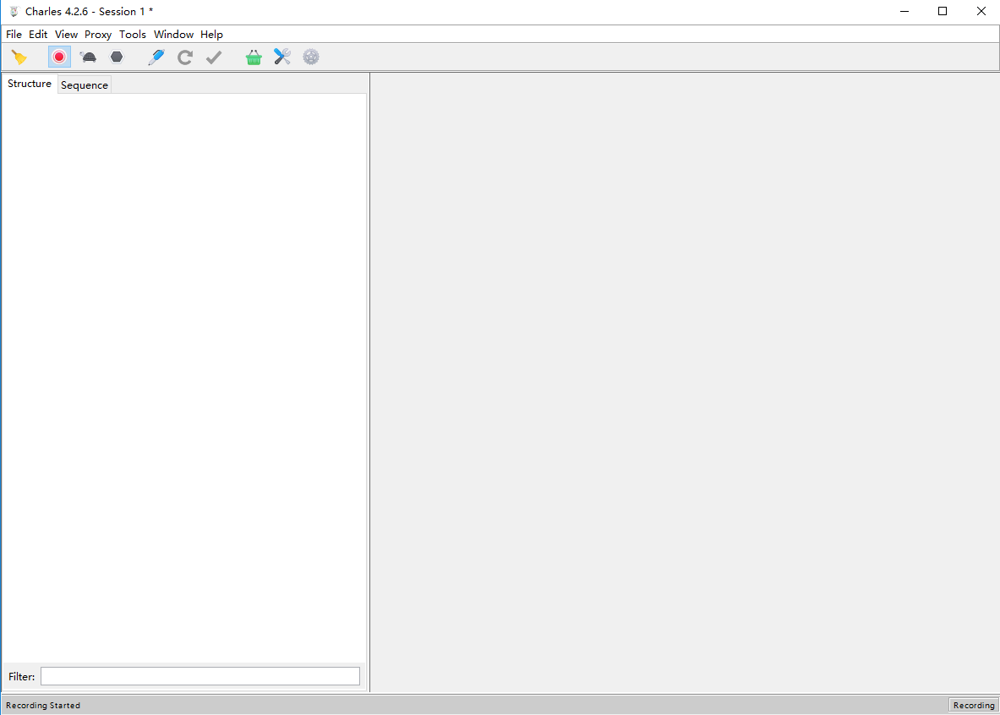

软件打开就是这个样子,具体怎么安装证书,我这里就不讲解了,网络上教程还是挺多的

打开 `Proxy`  ->  `Proxy Settings`  

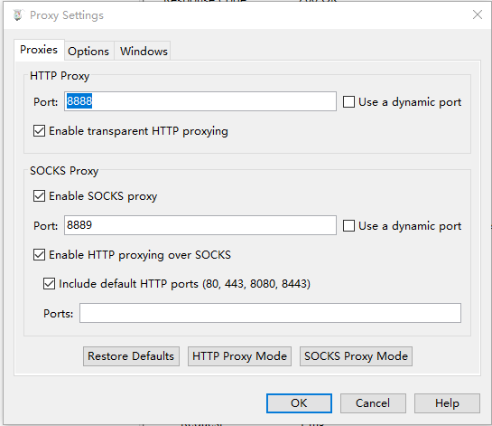

检查一下端口是否打开,接下来通过手机和模拟器连接本地,我这里就通过手机来演示了,我认为手机还是比模拟器方便的

1. 首先`Windows` 打开`CMD` ,输入 `ipconfig` ,找到以太网 IPV4 

   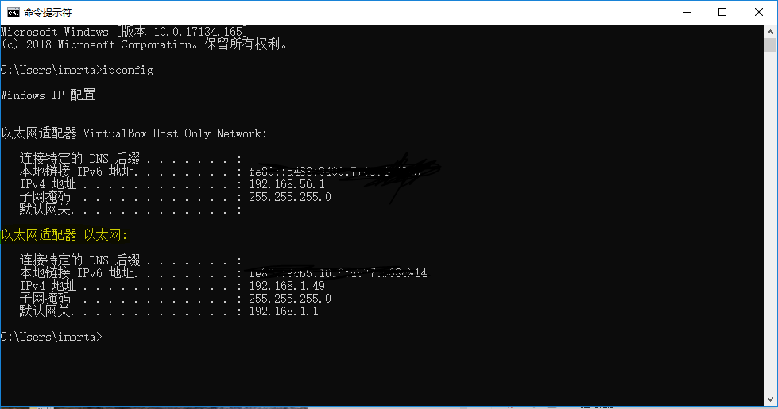

找到 `以太网适配器 以太网` 别找到其他的了, 我这里的 `IPV4 地址` 是 `192.168.1.49` ,所以手机应该设置代理为 IP `192.168.1.49` 端口为 `8888`, 对了 ,**手机需要连接电脑同一网络下的WIFI或者电脑的热点WIFI ,否则是不行的**

2.  Linux/Unix 用户应该就不用我说了吧,都是大佬 打开`终端`, 输入 `ifconfig  `

   ```
   root@iZwz96yoph60zayn2arjstZ:~# ifconfig -a
   eth0      Link encap:Ethernet  HWaddr 00:**:3e:**:45:bc  
             inet addr:172.**.**.***  Bcast:172.**.**.***  Mask:255.255.192.0
             UP BROADCAST RUNNING MULTICAST  MTU:1500  Metric:1
             RX packets:20**66 errors:0 dropped:0 overruns:0 frame:0
             TX packets:17**64 errors:0 dropped:0 overruns:0 carrier:0
             collisions:0 txqueuelen:1000 
             RX bytes:117837880 (117.8 MB)  TX bytes:209340524 (209.3 MB)
   
   lo        Link encap:Local Loopback  
             inet addr:127.0.0.1  Mask:255.0.0.0
             UP LOOPBACK RUNNING  MTU:6**36  Metric:1
             RX packets:3**18 errors:0 dropped:0 overruns:0 frame:0
             TX packets:3**18 errors:0 dropped:0 overruns:0 carrier:0
             collisions:0 txqueuelen:1 
             RX bytes:25**728 (2.5 MB)  TX bytes:2577728 (2.5 MB)
   ```

   这里 `eth0` 和其他的不要搞混淆了

3. 我是魅族手机大概演示一下设置, 打开`WIFI` -> 找到 `WIFI名称后的设置小按钮` -> 找到 `代理设置` 点击进去,把 `IP` , `端口 `设置好 ,结果如图

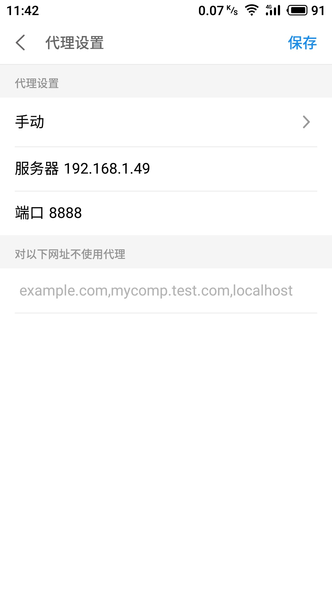 

配置好后,打开  `Charles`,发现多了非常多数据,一闪一闪

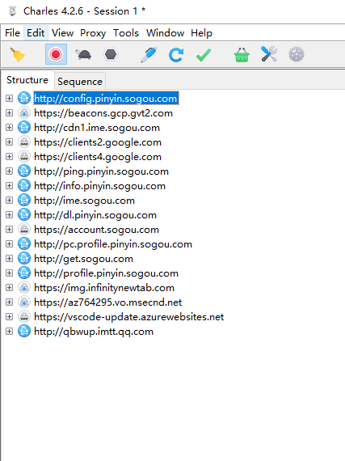

OK 这一步完成,接下来就是 点击一下左上角的`黄色扫帚` ,`红色按钮`左边,清空一下列表,然后打开 `美之图`APP,获取信息

打开`APP`之后一直往下拉,先加载一些数据出来看看, 这时候要仔细看看那一条信息一直在闪


这是打开之后得到的数据,大致可以看出来,因为我们是要抓 `meizitu`(美之图),所以数据肯定不是`qq`啥的

这时候拿着手机,使劲往下拉,看看那个在动, 这时候发现

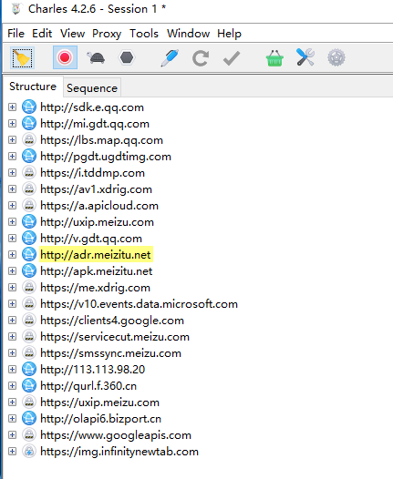

`http://adr.meizitu.net`这条数据一直在闪,我们打开看看

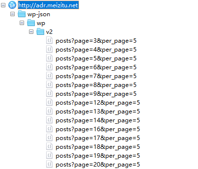

咦,这种数据好熟悉啊, 好像`Ajax`打开看一下

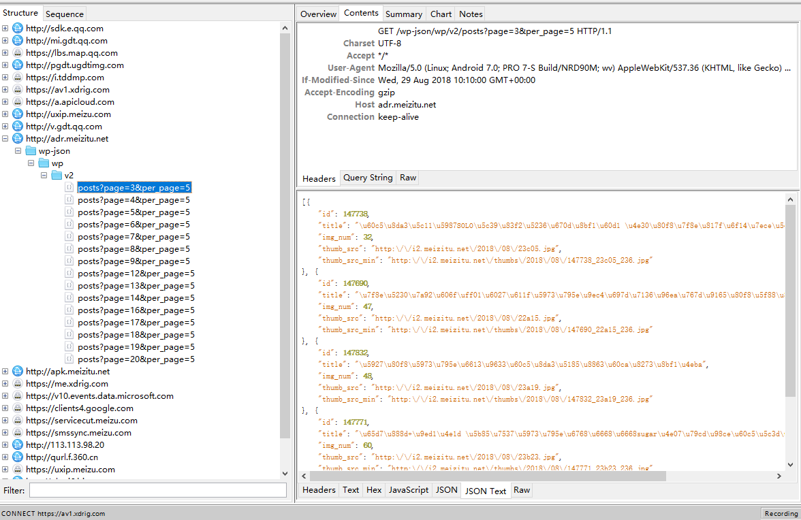

一目了然了 

再来看看数据规律

```
posts?page=3&per_page=5
posts?page=4&per_page=5
posts?page=5&per_page=5
posts?page=6&per_page=5
posts?page=7&per_page=5
posts?page=8&per_page=5
posts?page=9&per_page=5
...
```

`page` 就是页数, `per_page` 是什么呢,复制他的URL到浏览器看看

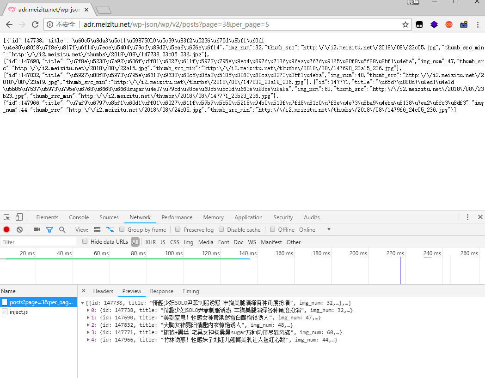

好像摸到规律了有没有, `per_page` 应该是每次加载得到的数据,我们把 `5` 改一下试试


结果显然是的,这时候我们肯定都想知道那他最大能提取多少呢,我试过了 最大是`100` /滑稽

OK结束了,写代码了......你确定不认真看看数据里面的信息吗?

我们打开看看里面有些什么东西


这东西...需要打马赛克吗 ???

我之前直接提取 `thumb_src` ,抓取图片到最后发现图片没有多少,只有`1.8G`, 这就感觉很不对了,我打开 `APP` 发现每一个`美女`最少都有`20`张图片,但是到了这里怎么就只有一张了呢?

这时候 发现了`img_num`,这个数目应该就是图片的张数,但是还是无法解决(这里大佬看了别嫌我笨啊,我第一次遇到这种情况)

然后我发现 `thumb_src`最后`2`位数,,,,,,,,,,,,,,,,试试,结果一试就成了

这时候大体的流程就完成了

## 代码

这里就上核心代码了,完整代码在项目里去看吧 地址:https://github.com/cexll/Mzitu.net_Spider

```
def get_index(page, per):
    """
    打开url得到JSON
    :param page: 页数
    :param per: 数量
    """
    url = 'http://adr.meizitu.net/wp-json/wp/v2/posts?page=' + str(page) + '&per_page=' + str(per)
    print(url)
    try: 
        req = requests.get(url)
        if req.status_code == 200:
            imgs = req.json()
            for item in imgs:
                img_num = item.get('img_num')
                img_url = item.get('thumb_src')
                title = item.get('title')
                for i in range(1, img_num+1):
                    if i >= 10:
                        u = img_url[0:-6]
                        ur = u + str(i) + '.jpg'
                        print("图片总数: {}, 图片地址: {}, 图片标题: {}".format(img_num, ur, title))
                        # 保存到JSON
                        save_to_json(ur, title)
                        # 保存图片到本地
                        save_image(ur)
                    else:
                        u = img_url[0:-5]
                        ur = u + str(i) + '.jpg'
                        print(ur, title)
                        print("图片总数: {}, 图片地址: {}, 图片标题: {}".format(img_num, ur, title))
                        # 保存到JSON
                        save_to_json(ur, title)
                        # 保存图片到本地
                        save_image(ur)
    except ConnectionError:
        pass
```

代码大概意思是通过打开`URL`得到`JSON`数据返回,解析里面的`图片URL`和`img_num`,再通过循环从`1`到`img_num`(我这里写的简单粗暴,有更方便的方法可以告诉我),图片URL后面通过切片来拼接图片的链接

然后通过将`标题`和`图片URL`保存到本地,图片下载到本地,通过两个函数实现,如果不下载图片

不需要多少时间,但下载图片时间需要久一点,这里使用异步下载图片应该非常快,但我认为做爬虫也要有爬虫的尊严,小站就别大批量的去访问了

**运行结果(不保存图片)**

```
root@iZwz96yoph60zayn2arjstZ:/home/admin/in/Mzitu.net_Spi_Spider# ls -lh
total 17M
-rw-r--r-- 1 root  root   17M Aug 30 11:18 18 result.json
-rw
-rwxrwxr-x 1 admin admin 2.3K Aug 29 22:23 23 Spider.py
```

这是在服务器下运行只保存信息到本地,全站图片数据有`17M`

最后


再最后,我把我保存到本地的图片打包放到百度网盘了,有需要的去取...别问我那么大什么时候能下载完成,点[这里](https://www.speedpan.com/)


网盘地址: [这里](https://pan.baidu.com/s/1itHFavOcVX_J5ttgU8dGJQ ) 提取码:(57iu)

*由于打包在一个压缩包太大了,而且也无法上传,就分了4份,每一份1G左右,每一张图片不重复*

